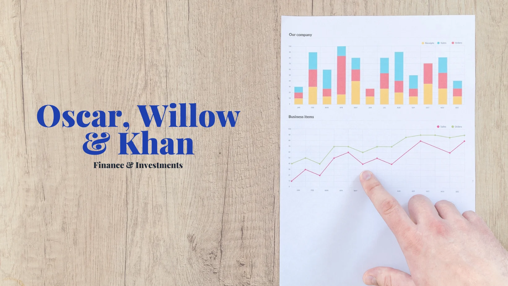

This is a single page website for fake investment company _Oscar, Willow & Khan_, built in Next.js and Tailwind CSS.

## Demo

[Live Demo](https://oscarwillowkhan.vercel.app/)

## Why Does This Exist?

It's pretty simple, really. I wanted a reason to showcase my frontend development skills for a single page website.

I chose the subject of an investment firm because the professional nature of the field meant that I could 'flex my UI/UX muscles' via a more formal design. Furthermore, as a semi-complex subject matter, the information would need to be easily parsable to the average potential customer. I reasoned this would be best suited to a single page website, so as to not overwhelm them, whilst also making any services and contact information easy to find.

## Why Use React/Next.js For Such a Simple Website?

It may seem like overkill to use React for a single page website, but there were three primary reasons:

1. On a purely personal level, I'm faster developing in a Next.js environment. I've used it extensively and thus knew I could bash the project out in a vastly reduced time, simply because I needed to think less.
2. Similarly, I'm well versed with Framer Motion. Using React meant I could rely on this library for animations, and thus spend less time thinking about how to do what I needed to do, and spend more time doing what I needed to do.
3. For a single page website split into multiple sections, I liked the idea of writing those sections as their own components and then just importing them into the main index.js file. This approach felt more organised to me, making it easier to jump around and edit, whilst also making any reordering of where sections sit on the page mind numblingly simple.

## Technology Used

- Next.js
- Tailwind CSS
- Framer Motion
- React Hook Form
- React Scroll

## Run Locally

Clone the project

```bash
  git clone https://github.com/vitamins999/oscar-willow-khan-investments.git
```

Go to the project directory

```bash
  cd oscar-willow-khan-investments
```

Install dependencies

```bash
  npm install
```

Start the server

```bash
  npm run dev
```

## License

[](https://github.com/tterb/atomic-design-ui/blob/master/LICENSEs)

## Authors

- [Jools Barnett](https://www.github.com/vitamins999)
